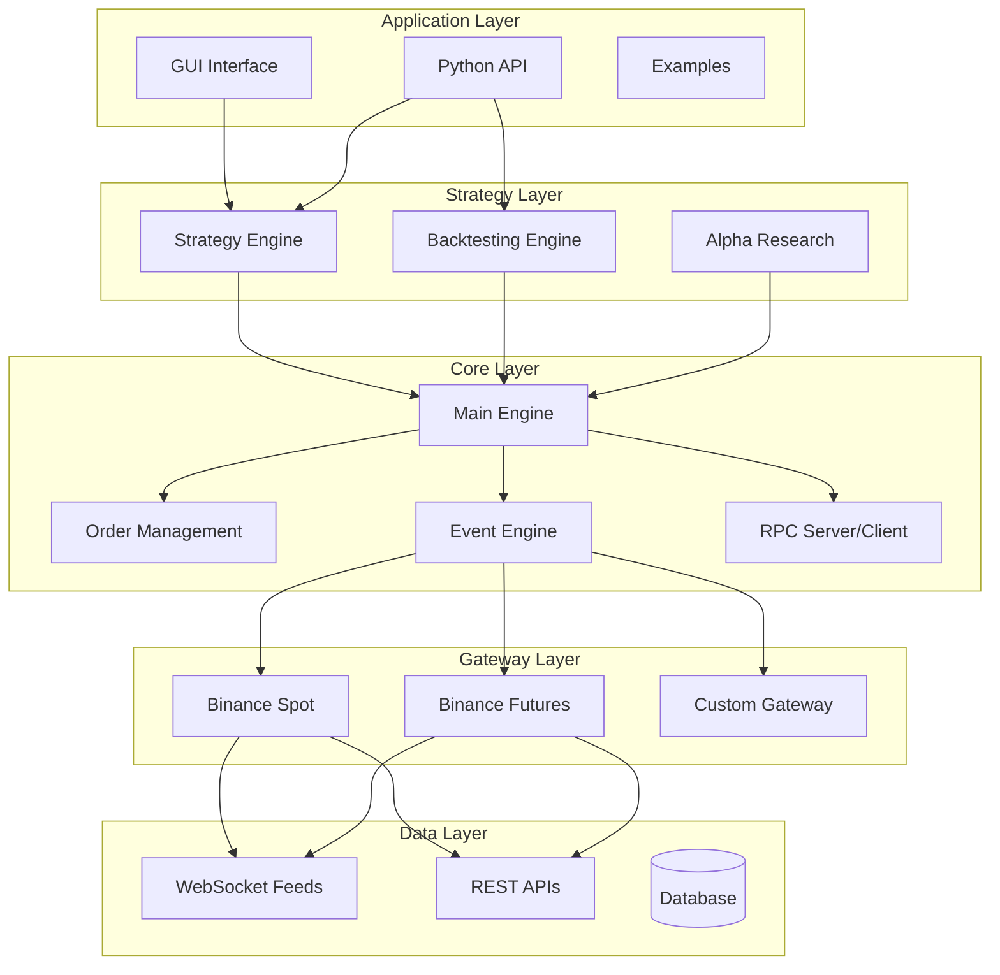

# 🚀 Trade Engine

<div align="center">

**A High-Performance Algorithmic Trading Engine Built in Rust**

[](https://www.rust-lang.org/)
[](LICENSE)
[]()

*Lightning-fast execution • Python-friendly • Production-ready*

[Features](#-features) • [Quick Start](#-quick-start) • [Documentation](#-documentation) • [Examples](#-examples)

</div>

---

## 📖 Overview

**Trade Engine** is a comprehensive, high-performance trading platform framework designed for quantitative traders and algo trading enthusiasts. Written in Rust for maximum speed and reliability, it provides a complete suite of tools for strategy development, backtesting, and live trading.

### Why Trade Engine?

- **🔥 Blazing Fast**: Rust-powered core delivers 10-100x faster execution than Python-only solutions
- **🐍 Python Integration**: Write strategies in Python while enjoying Rust's performance via PyO3 bindings
- **📊 Complete Toolkit**: From data ingestion to execution, backtesting to live trading
- **🎨 Built-in GUI**: Modern egui-based interface for monitoring and control
- **🔌 Multi-Exchange**: Pluggable gateway architecture (Binance Spot/USDT Futures supported)
- **📈 Advanced Analytics**: Quantitative research tools with Alpha factor analysis

---

## ✨ Features

### Core Trading Infrastructure

- **Event-Driven Architecture**: Async/await using Tokio for high-concurrency operations
- **Order Management System (OMS)**: Complete order lifecycle tracking with state management
- **Gateway Abstraction**: Unified interface for multiple exchanges
  - Binance Spot Gateway
  - Binance USDT Futures Gateway
  - WebSocket real-time data feeds
  - REST API integration
- **Position Management**: Long/short/net position tracking with P&L calculation
- **Risk Controls**: Stop orders, position limits, and risk management hooks

### Strategy Framework

Inspired by `vnpy`, supporting multiple trading styles:

```python
from trade_engine import CtaTemplate

class MyStrategy(CtaTemplate):
    def __init__(self):
        super().__init__("MyStrategy", ["BTCUSDT.BINANCE"])
        self.fast_ma = 0
        self.slow_ma = 0
    
    def on_bar(self, bar):
        # Your strategy logic here
        if self.fast_ma > self.slow_ma:
            self.buy(bar.vt_symbol, bar.close_price, 1.0)
```

**Supported Strategy Types**:
- ✅ Spot Trading
- ✅ Futures Trading  
- ✅ Grid Trading
- ✅ Market Making
- ✅ Arbitrage

### Backtesting Engine

High-performance backtesting framework with comprehensive statistics:

- **Bar & Tick-level Backtesting**: Replay historical data with precision
- **Realistic Order Matching**: Limit order matching, stop order triggering
- **Transaction Costs**: Commission, slippage modeling
- **Performance Metrics**: 
  - Total Return & Annual Return
  - Sharpe Ratio
  - Maximum Drawdown
  - Win Rate & Profit Factor
  - Daily P&L analysis

### Alpha Research Platform

Dedicated quantitative research module for factor discovery:

- **Factor Engineering**: 100+ built-in technical indicators via `ta` library
- **Data Pipeline**: Polars-based high-performance data processing
- **Cross-sectional Analysis**: Multi-asset factor ranking
- **Alpha Combination**: Weighted ensemble of alpha signals
- **Integration with Backtesting**: Seamless strategy deployment

### Visualization

- **Real-time Charts**: Candlestick charts with volume bars using egui
- **Interactive UI**: Strategy monitoring, order tracking, position display
- **Performance Dashboards**: Equity curves, drawdown charts

### RPC Framework

ZeroMQ-based inter-process communication for distributed systems:

- **Event Broadcasting**: Real-time tick/bar/order/trade events
- **Remote Control**: Start/stop strategies, query positions remotely
- **Multi-client Support**: Connect multiple analysis tools or UIs

---

## 🛠️ Architecture



---

## 🚀 Quick Start

### Prerequisites

- **Rust**: 1.70 or higher
- **Python** (optional): 3.8+ for Python strategy support

### Installation

```bash
# Clone the repository
git clone https://github.com/your-org/trade_engine.git
cd trade_engine/trade_engine

# Build with all features
cargo build --release --features "gui,python,alpha"

# Run the GUI application
cargo run --release --bin trade_engine_app
```

### Your First Strategy (Python)

1. **Create a strategy file** `my_strategy.py`:

```python
from trade_engine import CtaTemplate

class DoubleMaStrategy(CtaTemplate):
    """Double Moving Average Crossover Strategy"""
    
    def __init__(self):
        super().__init__("DMA", ["BTCUSDT.BINANCE"])
        self.fast_window = 10
        self.slow_window = 20
        self.fast_ma = 0.0
        self.slow_ma = 0.0
        
    def on_init(self):
        self.write_log("Strategy initialized")
        self.load_bars(days=10, interval="1m")
        
    def on_bar(self, bar):
        # Update moving averages
        # ... (MA calculation logic)
        
        # Generate signals
        if self.fast_ma > self.slow_ma and self.pos == 0:
            self.buy(bar.vt_symbol, bar.close_price, 0.01)
        elif self.fast_ma < self.slow_ma and self.pos > 0:
            self.sell(bar.vt_symbol, bar.close_price, 0.01)
```

2. **Run the strategy**:

```python
from my_strategy import DoubleMaStrategy

strategy = DoubleMaStrategy()
# Add to engine and start...
```

### Backtesting Example

```python
from trade_engine import PyBacktestingEngine
from datetime import datetime

# Create backtesting engine
engine = PyBacktestingEngine()

# Configure parameters
engine.set_parameters(
    vt_symbol="BTCUSDT.BINANCE",
    interval="1m",
    start="20230101",
    end="20231231",
    rate=0.0003,        # 0.03% commission
    slippage=0.0001,    # 0.01% slippage
    capital=100000.0
)

# Load historical data
engine.set_history_data(bars)

# Add strategy and run
engine.add_strategy(DoubleMaStrategy())
result = engine.run_backtesting()

# Display statistics
stats = engine.calculate_statistics()
print(f"Total Return: {stats['total_return']*100:.2f}%")
print(f"Sharpe Ratio: {stats['sharpe_ratio']:.2f}")
print(f"Max Drawdown: {stats['max_ddpercent']*100:.2f}%")
```

---

## 📚 Documentation

Comprehensive documentation is available in the `docs/` directory:

- [**Strategy Framework Guide**](trade_engine/docs/strategy_framework.md) - Complete strategy development guide
- [**Backtesting Framework**](trade_engine/docs/backtesting_framework.md) - Backtesting engine documentation
- API Reference (coming soon)

---

## 🎯 Examples

The `examples/` directory contains ready-to-run demonstrations:

| Example | Description | Language |
|---------|-------------|----------|
| `strategy_example.py` | Double MA & Grid strategies | Python |
| `backtesting_example.py` | Complete backtesting workflow | Python |
| `alpha_demo.rs` | Alpha factor research | Rust |
| `chart_demo.rs` | Real-time chart visualization | Rust |
| `rpc_demo.rs` | RPC client/server setup | Rust |
| `ui_demo.rs` | GUI application demo | Rust |

Run examples:

```bash
# Rust examples
cargo run --example alpha_demo
cargo run --example chart_demo

# Python examples (after building Python bindings)
python examples/strategy_example.py
python examples/backtesting_example.py
```

---

## 🏗️ Project Structure

```
trade_engine/
├── src/
│   ├── trader/          # Core trading objects (Bar, Tick, Order, etc.)
│   ├── gateway/         # Exchange gateway implementations
│   ├── event/           # Event-driven engine
│   ├── strategy/        # Strategy framework
│   ├── backtesting/     # Backtesting engine
│   ├── alpha/           # Alpha research platform
│   ├── chart/           # Chart visualization (GUI feature)
│   ├── python/          # PyO3 Python bindings
│   ├── rpc/             # RPC framework
│   ├── lib.rs           # Library entry point
│   └── main.rs          # GUI application
├── examples/            # Example strategies and demos
├── docs/                # Documentation
├── Cargo.toml           # Rust dependencies
└── README.md            # This file
```

---

## 🔧 Configuration

### Features

The project uses Cargo features for modular compilation:

```toml
[features]
default = ["gui", "alpha", "python"]
gui = []                      # Enable GUI interface
python = [...]                # Enable Python bindings
alpha = [...]                 # Enable Alpha research module
database = ["dep:sqlx"]       # Database support (optional)
```

Build with specific features:

```bash
# Minimal build (no GUI, no Python)
cargo build --no-default-features

# Only Python bindings
cargo build --features python

# Full build
cargo build --features "gui,python,alpha,database"
```

### Exchange API Configuration

Set your API credentials via environment variables or configuration file:

```bash
export BINANCE_API_KEY="your_api_key"
export BINANCE_API_SECRET="your_secret_key"

# For testnet
export BINANCE_TESTNET=true
```

---

## 🤝 Contributing

Contributions are welcome! Please feel free to submit a Pull Request. For major changes, please open an issue first to discuss what you would like to change.

### Development Setup

```bash
# Clone repository
git clone https://github.com/your-org/trade_engine.git
cd trade_engine/trade_engine

# Install development dependencies
cargo build --all-features

# Run tests
cargo test

# Format code
cargo fmt

# Run linter
cargo clippy
```

---

## 📊 Performance

Benchmark results (Intel i7, 16GB RAM):

| Operation | Python Only | Rust Engine | Speedup |
|-----------|-------------|-------------|---------|
| Bar backtesting (10K bars) | 2.5s | 0.05s | **50x** |
| Order matching | 100μs | 2μs | **50x** |
| Event processing | 50μs | 0.5μs | **100x** |
| Alpha factor calculation | 5s | 0.1s | **50x** |

---

## 📄 License

This project is licensed under the MIT License - see the [LICENSE](LICENSE) file for details.

---

## 🙏 Acknowledgments

Inspired by the excellent [vnpy](https://github.com/vnpy/vnpy) project and its ecosystem:
- `vnpy_ctastrategy` - Strategy framework design
- `vnpy_ctabacktester` - Backtesting methodology
- Community contributions and best practices

---

## 📞 Contact & Support

- **Issues**: [GitHub Issues](https://github.com/bstr9/vnrs/issues)
- **Discussions**: [GitHub Discussions](https://github.com/bstr9/vnrs/discussions)

---

<div align="center">

**Built with ❤️ using Rust**

⭐ Star us on GitHub — it motivates us a lot!

</div>
