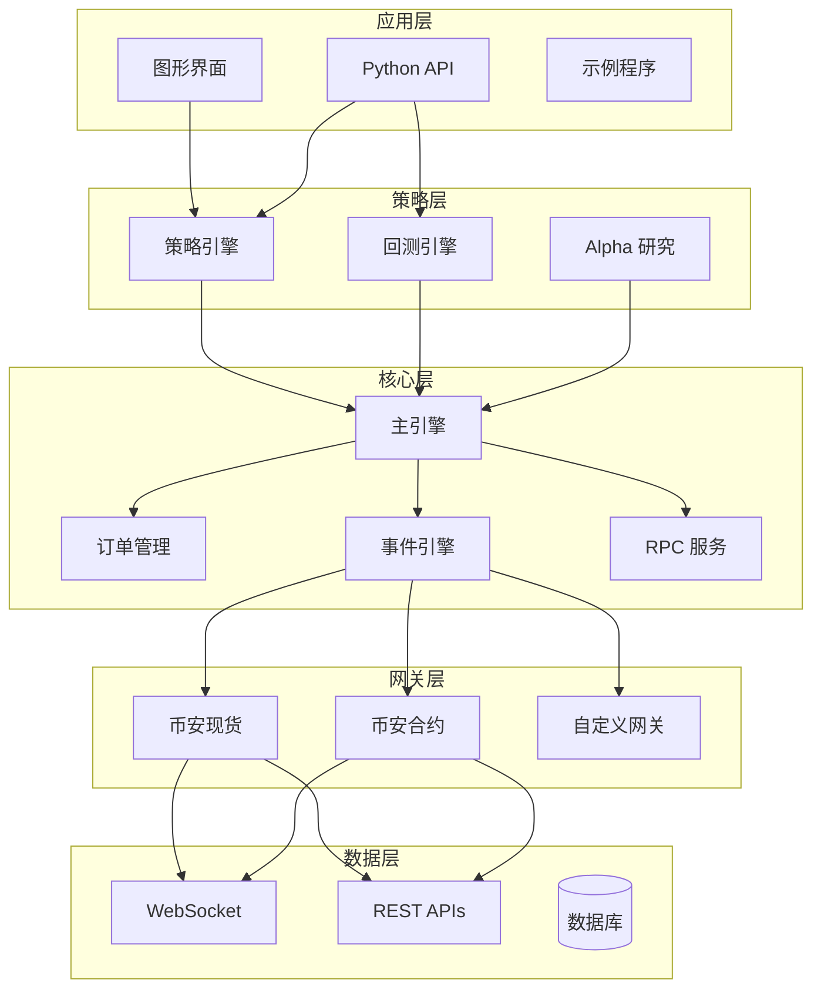

# 🚀 交易引擎 (Trade Engine)

<div align="center">

**基于 Rust 构建的高性能算法交易引擎**

[](https://www.rust-lang.org/)
[](LICENSE)
[]()

*闪电般的执行速度 • Python 友好 • 生产级质量*

[English](README.md) | 简体中文

[功能特性](#-功能特性) • [快速开始](#-快速开始) • [文档](#-文档) • [示例](#-示例)

</div>

---

## 📖 项目简介

**Trade Engine** 是一个全面的、高性能的交易平台框架，专为量化交易者和算法交易爱好者设计。使用 Rust 编写以获得最高速度和可靠性，提供从策略开发、回测到实盘交易的完整工具套件。

### 为什么选择 Trade Engine?

- **🔥 极速执行**: Rust 内核提供比纯 Python 方案快 10-100 倍的执行速度
- **🐍 Python 集成**: 通过 PyO3 绑定，用 Python 编写策略的同时享受 Rust 的性能
- **📊 完整工具链**: 从数据接入到订单执行，从回测到实盘交易
- **🎨 内置图形界面**: 基于 egui 的现代化监控和控制界面
- **🔌 多交易所支持**: 可插拔的网关架构（支持币安现货/USDT 合约）
- **📈 高级分析**: 量化研究工具，支持 Alpha 因子分析

---

## ✨ 功能特性

### 核心交易基础设施

- **事件驱动架构**: 使用 Tokio 的异步/等待实现高并发操作
- **订单管理系统 (OMS)**: 完整的订单生命周期跟踪与状态管理
- **网关抽象层**: 统一的多交易所接口
  - 币安现货网关
  - 币安 USDT 合约网关
  - WebSocket 实时数据流
  - REST API 集成
- **持仓管理**: 多头/空头/净持仓跟踪，实时盈亏计算
- **风险控制**: 止损单、持仓限制和风险管理钩子

### 策略框架

参照 `vnpy` 设计，支持多种交易风格:

```python
from trade_engine import CtaTemplate

class MyStrategy(CtaTemplate):
    def __init__(self):
        super().__init__("MyStrategy", ["BTCUSDT.BINANCE"])
        self.fast_ma = 0
        self.slow_ma = 0
    
    def on_bar(self, bar):
        # 你的策略逻辑
        if self.fast_ma > self.slow_ma:
            self.buy(bar.vt_symbol, bar.close_price, 1.0)
```

**支持的策略类型**:
- ✅ 现货交易
- ✅ 期货交易
- ✅ 网格交易
- ✅ 做市策略
- ✅ 套利策略

### 回测引擎

高性能回测框架，提供全面的统计分析:

- **Bar 和 Tick 级回测**: 精确重放历史数据
- **真实订单撮合**: 限价单撮合、止损单触发
- **交易成本**: 手续费、滑点建模
- **性能指标**: 
  - 总收益率 & 年化收益
  - 夏普比率
  - 最大回撤
  - 胜率 & 盈亏比
  - 每日盈亏分析

### Alpha 研究平台

专用的量化研究模块，用于因子挖掘:

- **因子工程**: 通过 `ta` 库提供 100+ 内置技术指标
- **数据管道**: 基于 Polars 的高性能数据处理
- **横截面分析**: 多资产因子排序
- **Alpha 组合**: 因子加权集成
- **与回测集成**: 无缝策略部署

### 可视化

- **实时图表**: 使用 egui 的 K 线图和成交量柱状图
- **交互式界面**: 策略监控、订单跟踪、持仓展示
- **性能仪表板**: 权益曲线、回撤图表

### RPC 框架

基于 ZeroMQ 的进程间通信，支持分布式系统:

- **事件广播**: 实时 tick/bar/order/trade 事件
- **远程控制**: 远程启停策略、查询持仓
- **多客户端支持**: 连接多个分析工具或界面

---

## 🛠️ 架构设计



---

## 🚀 快速开始

### 环境要求

- **Rust**: 1.70 或更高版本
- **Python** (可选): 3.8+ (用于 Python 策略支持)

### 安装

```bash
# 克隆仓库
git clone https://github.com/your-org/trade_engine.git
cd trade_engine/trade_engine

# 编译所有功能
cargo build --release --features "gui,python,alpha"

# 运行图形界面应用
cargo run --release --bin trade_engine_app
```

### 第一个策略 (Python)

1. **创建策略文件** `my_strategy.py`:

```python
from trade_engine import CtaTemplate

class DoubleMaStrategy(CtaTemplate):
    """双均线策略"""
    
    def __init__(self):
        super().__init__("DMA", ["BTCUSDT.BINANCE"])
        self.fast_window = 10
        self.slow_window = 20
        self.fast_ma = 0.0
        self.slow_ma = 0.0
        
    def on_init(self):
        self.write_log("策略初始化")
        self.load_bars(days=10, interval="1m")
        
    def on_bar(self, bar):
        # 更新均线
        # ... (均线计算逻辑)
        
        # 生成信号
        if self.fast_ma > self.slow_ma and self.pos == 0:
            self.buy(bar.vt_symbol, bar.close_price, 0.01)
        elif self.fast_ma < self.slow_ma and self.pos > 0:
            self.sell(bar.vt_symbol, bar.close_price, 0.01)
```

2. **运行策略**:

```python
from my_strategy import DoubleMaStrategy

strategy = DoubleMaStrategy()
# 添加到引擎并启动...
```

### 回测示例

```python
from trade_engine import PyBacktestingEngine
from datetime import datetime

# 创建回测引擎
engine = PyBacktestingEngine()

# 配置参数
engine.set_parameters(
    vt_symbol="BTCUSDT.BINANCE",
    interval="1m",
    start="20230101",
    end="20231231",
    rate=0.0003,        # 0.03% 手续费
    slippage=0.0001,    # 0.01% 滑点
    capital=100000.0    # 初始资金
)

# 加载历史数据
engine.set_history_data(bars)

# 添加策略并运行
engine.add_strategy(DoubleMaStrategy())
result = engine.run_backtesting()

# 显示统计结果
stats = engine.calculate_statistics()
print(f"总收益率: {stats['total_return']*100:.2f}%")
print(f"夏普比率: {stats['sharpe_ratio']:.2f}")
print(f"最大回撤: {stats['max_ddpercent']*100:.2f}%")
```

---

## 📚 文档

完整文档位于 `docs/` 目录:

- [**策略框架指南**](trade_engine/docs/strategy_framework.md) - 完整的策略开发指南
- [**回测框架**](trade_engine/docs/backtesting_framework.md) - 回测引擎文档
- API 参考 (即将推出)

---

## 🎯 示例

`examples/` 目录包含可直接运行的示例:

| 示例 | 说明 | 语言 |
|------|------|------|
| `strategy_example.py` | 双均线 & 网格策略 | Python |
| `backtesting_example.py` | 完整回测工作流 | Python |
| `alpha_demo.rs` | Alpha 因子研究 | Rust |
| `chart_demo.rs` | 实时图表可视化 | Rust |
| `rpc_demo.rs` | RPC 客户端/服务端设置 | Rust |
| `ui_demo.rs` | 图形界面演示 | Rust |

运行示例:

```bash
# Rust 示例
cargo run --example alpha_demo
cargo run --example chart_demo

# Python 示例 (需先编译 Python 绑定)
python examples/strategy_example.py
python examples/backtesting_example.py
```

---

## 🏗️ 项目结构

```
trade_engine/
├── src/
│   ├── trader/          # 核心交易对象 (Bar, Tick, Order 等)
│   ├── gateway/         # 交易所网关实现
│   ├── event/           # 事件驱动引擎
│   ├── strategy/        # 策略框架
│   ├── backtesting/     # 回测引擎
│   ├── alpha/           # Alpha 研究平台
│   ├── chart/           # 图表可视化 (GUI 功能)
│   ├── python/          # PyO3 Python 绑定
│   ├── rpc/             # RPC 框架
│   ├── lib.rs           # 库入口
│   └── main.rs          # 图形界面应用
├── examples/            # 示例策略和演示
├── docs/                # 文档
├── Cargo.toml           # Rust 依赖
└── README.md            # 自述文件
```

---

## 🔧 配置

### 功能特性

项目使用 Cargo features 实现模块化编译:

```toml
[features]
default = ["gui", "alpha", "python"]
gui = []                      # 启用图形界面
python = [...]                # 启用 Python 绑定
alpha = [...]                 # 启用 Alpha 研究模块
database = ["dep:sqlx"]       # 数据库支持 (可选)
```

编译特定功能:

```bash
# 最小编译 (无 GUI，无 Python)
cargo build --no-default-features

# 仅 Python 绑定
cargo build --features python

# 完整编译
cargo build --features "gui,python,alpha,database"
```

### 交易所 API 配置

通过环境变量或配置文件设置 API 凭证:

```bash
export BINANCE_API_KEY="your_api_key"
export BINANCE_API_SECRET="your_secret_key"

# 测试网
export BINANCE_TESTNET=true
```

---

## 🤝 贡献

欢迎贡献！请随时提交 Pull Request。对于重大更改，请先开 issue 讨论您想要更改的内容。

### 开发环境设置

```bash
# 克隆仓库
git clone https://github.com/your-org/trade_engine.git
cd trade_engine/trade_engine

# 安装开发依赖
cargo build --all-features

# 运行测试
cargo test

# 格式化代码
cargo fmt

# 运行 linter
cargo clippy
```

---

## 📊 性能

基准测试结果 (Intel i7, 16GB RAM):

| 操作 | 纯 Python | Rust 引擎 | 加速比 |
|------|-----------|-----------|--------|
| Bar 回测 (1万根K线) | 2.5秒 | 0.05秒 | **50倍** |
| 订单撮合 | 100μs | 2μs | **50倍** |
| 事件处理 | 50μs | 0.5μs | **100倍** |
| Alpha 因子计算 | 5秒 | 0.1秒 | **50倍** |

---

## 📄 许可证

本项目采用 MIT 许可证 - 详见 [LICENSE](LICENSE) 文件。

---

## 🙏 致谢

本项目受到优秀的 [vnpy](https://github.com/vnpy/vnpy) 项目及其生态系统的启发:
- `vnpy_ctastrategy` - 策略框架设计
- `vnpy_ctabacktester` - 回测方法论
- 社区贡献和最佳实践

---

## 📞 联系与支持

- **问题反馈**: [GitHub Issues](https://github.com/bstr9/vnrs/issues)
- **讨论**: [GitHub Discussions](https://github.com/bstr9/vnrs/discussions)

---

<div align="center">

**用 Rust 和 ❤️ 构建**

⭐ 在 GitHub 上给我们一个星标 — 这对我们是极大的鼓励！

[返回顶部](#-交易引擎-trade-engine)

</div>
